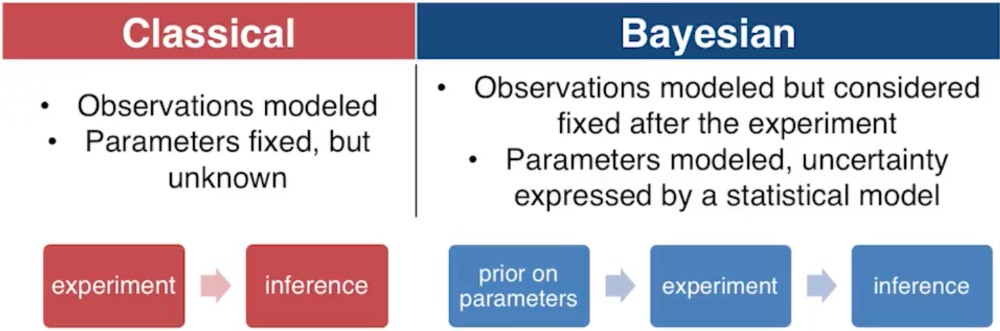

# Bayesian Statistics

ISyE6420 by [Brani Vidakovic](https://www.isye.gatech.edu/users/brani-vidakovic) is licensed under a [Creative Commons Attribution-NonCommercial 4.0 International License](https://creativecommons.org/licenses/by-nc/4.0/).

**To read the math, either** 
1. Install a [Chrome plugin](https://chrome.google.com/webstore/detail/mathjax-plugin-for-github/ioemnmodlmafdkllaclgeombjnmnbima) to read math on GitHub directly.
2. Use the VSCode Markdown previewer (supports math as of [version 1.58](https://github.com/microsoft/vscode-docs/blob/vnext/release-notes/v1_58.md#math-formula-rendering-in-the-markdown-preview)).

<!-- START doctoc -->
<!-- END doctoc -->

# Background

Professor Vidakovic gives details on the life and work of Reverand Thomas Bayes. I am not sure we will be tested on any of this, but the curious student can find details on [wikipedia](https://en.wikipedia.org/wiki/Thomas_Bayes).

Bayes' relevance to Bayes Theorem is that one of his papers that was published posthumously has a special case of Bayes Theorem. Pierre-Simon Laplace generalizes this result to what we now recognize as Bayes' Theorem, (more on this later, don't worry)

$$Pr(A_i | B) = Pr(A_i)\frac{\text{Pr}(B|A_i)}{\sum_j \text{Pr}(B|A_j)}$$

## Classical vs. Bayesian Statistics

Suppose we flip a coin 10 times and get 10 tails.

If the probability of getting heads is $p$ then the probability of this happening is $(1-p)^{10}$. The probability of this happening is maximized when $p=0$, and the frequentist approach will estimate that $p=0$.

In a Bayesian approach we find the probability distribution of our unknown parameter given some prior distribution. **We omit some details for now**.

We have an initial estimate of the probability distribution of $p$ as being uniform on the interval $[0,1]$. We update this estimate with the likelihood from our experiment and get a new density function of

$$(1-p)^{10}*1$$

We normalize this density function to integrate to 1,

$$11(1-p)^{10}$$

We can now get more meaningful information about the probability distribution like the

- mean = 1/12
- median = $(-.5)^{\frac{1}{11}}+1$ = .061069
- mode = 0

## FDA Guidance

Professor Vidakovic summarizes [FDA guidance on the use of Bayesian statistics](https://www.fda.gov/media/71512/download).

The FDA is advocating for the use of Bayesian methods in development of medical devices.

- Prior information from other devices with similar mechanisms of action is available and can be used by Bayesian methods.
- Bayesian approaches may be simpler and less burdensome.
- Prior information may reduce the required size of the trial.
- Size of a trial can be reduced by early stopping
  - Early stopping is more controversial when using frequentist methods compared to Bayesian
- Multiplicity problems are easier when using Bayesian approaches.
- Missing data is handled more gracefully by Bayesian approaches.
- Unlimited looks at the data are okay in Bayesian approaches, more complicated in frequentist approaches and involve "Alpha spending"

The ability to stop the trial early due to **inferiority** (the method is not good) or **superiority** (the method shows itself to be good) reduces the human and economic costs of medical trials.
